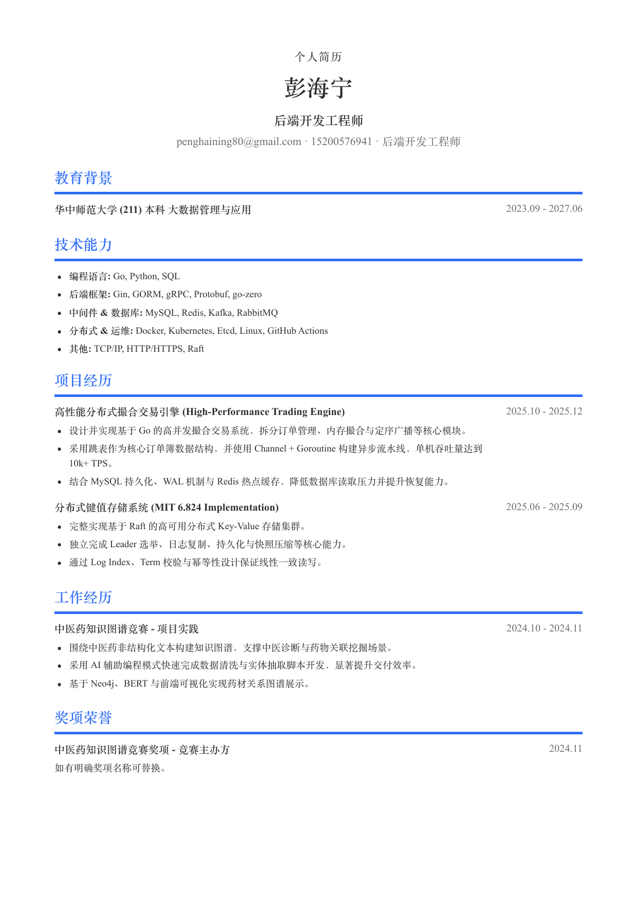

# Polished Resume

A Codex skill for generating polished resumes with an `HTML -> PDF` pipeline.

Instead of writing directly to Word, this skill treats structured resume data as the source of truth, renders a clean HTML layout, and exports a stable A4 PDF with headless Chrome.

## What it does

- turns raw resume materials into a normalized resume spec
- rewrites content into tighter, result-oriented bullets
- renders a clean technical-resume HTML template
- exports the final resume to PDF

## Why this approach

Most resume generators either:

- write directly into Word and fight formatting
- over-focus on form fields and under-invest in layout quality

This skill uses HTML as the layout source of truth so the visual result is easier to control, easier to iterate, and easier to keep consistent.

## Included

- `SKILL.md`: skill instructions and workflow
- `references/`: schema, intake template, writing rules, template notes
- `assets/`: HTML template, CSS, sample resume JSON, preview image
- `scripts/render_resume.py`: JSON -> HTML renderer
- `scripts/export_pdf.js`: HTML -> PDF exporter via headless Chrome

## Quick start

Render the sample input:

```bash
python3 scripts/render_resume.py assets/sample_resume.json /tmp/resume.html
node scripts/export_pdf.js /tmp/resume.html /tmp/resume.pdf
```

If Chrome is not installed in the default location, set:

```bash
export CHROME_PATH="/path/to/Google Chrome"
```

## Preview



## Input model

The renderer currently expects structured JSON. For new users, start from:

- `references/intake-template.md`
- `references/schema.md`

The recommended workflow is:

1. collect raw candidate info
2. normalize it into the schema
3. rewrite weak bullets
4. render HTML
5. export PDF

## Scope

Current version:

- optimized for concise technical resumes
- one-page A4 bias
- single template
- `HTML -> PDF` only

Not included yet:

- DOCX export
- multiple templates
- direct Markdown parser
- ATS-specific branching

## License

MIT
